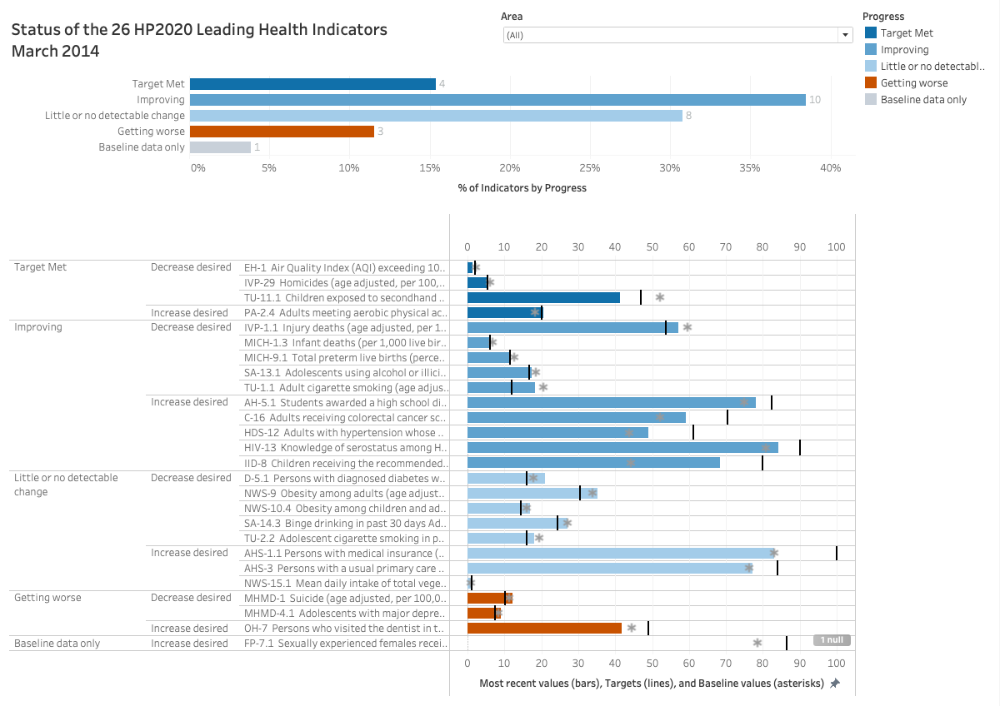

# Healthy People 2020: Leading Health Indicators – Tableau Visualizations

This dashboard visualizes the status of 26 Leading Health Indicators (LHIs) from Healthy People 2020. Users can explore proportions of indicators across progress categories using multiple part-to-whole chart formats.

---

## Visualizations

### 1. **Pie Chart**
- Color-coded for accessibility using Color Blind 10 palette
- Slices show % and count of indicators per category

### 2. **Bar Chart**
- Accurate part-to-whole comparison using stacked bars
- Sorted from best to worst progress

### 3. **Stacked Bar Chart**
- One-bar overview of LHI status with inline labels

### 4. **Bullet Graph Table**
- Each bullet compares baseline, current, and target values
- Metrics grouped by progress and direction of desired change

### 5. **Interactive Dashboard**
- Filters by health area
- Progress legend used for cross-highlighting
- Responsive design (1200 x 850 px)

---

## Features

- Wildcard filters and legend interactivity
- Shneiderman’s mantra: overview → zoom/filter → details-on-demand
- Accurate % labels, visual encoding, and consistent color use

---

## Screenshot

---

## Files Included

- `Unit9.png`: Dashboard screenshot
- `LHI-ProgressReport-ExecSum.xls`: Dataset used
- `project_description.md`: This project overview
