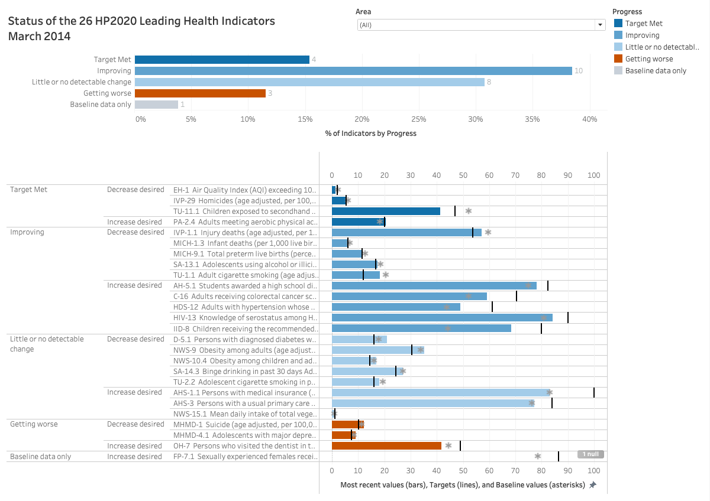

# Ciara-Lyn Lee Portfolio

Welcome! This repository showcases my work as a Master's student in Biomedical Informatics at UTHealth Science Center at Houston, focused on Health Data Science and Artificial Intelligence. Here you'll find curated coursework, project summaries, dashboard screenshots, and my professional resume.

---

## Resume  
My full resume is available [here](./Resume/CiaraLee_Resume.pdf).

---

## Coursework Highlights

As part of my M.S. program, I completed 39 credit hours covering core competencies in:

- Big Data Analytics with PySpark & SQL  
- Health Information Visualization (Tableau, Power BI)  
- Workflow Modeling and Project Management in Clinical Environments  
- Applied Data Management and Quality Improvement in Healthcare  
- Scientific Writing and Biostatistics  

View full course descriptions and technologies used in [Courses](./Courses/course_catalog.md).

---

## Projects

### 1. UTHealth School of Dentistry — Documentation Compliance Dashboard  
**Tools:** Power BI, DAX, EHR data  
**Skills:** Data mapping, calculated fields, interactive filters  
**Goal:** Visualize provider compliance with documentation standards to improve quality of care.  
[Project Summary](./Projects/PowerBI_Dental_Dashboard/project_description.md)  
*Note: No public files are shared due to HIPAA restrictions on patient-level EHR data.*

---

### 2. Multivariate Infection Analysis — Tableau Dashboard  
*Healthcare-Associated Infections in Harris County*  
**Tools:** Tableau  
**Skills:** Parallel coordinate plots, heatmaps, calculated fields  
**Goal:** Compare infection rates across six CDC-tracked metrics in local hospitals  
[Project Summary](./Projects/Multivariate_Infection_Rates/project_description.md)  

---

### 3. Deviation Analysis of AHRQ Patient Safety Indicators  
**Tools:** Tableau  
**Goal:** Evaluate monthly trends, target exceedance, and forecast year-end risks  
**Features:** Bullet graphs, forecasting, independent axes, patient safety CQO dashboard  
[Project Summary](./Projects/Deviation_Analysis_Dashboard/project_description.md)  

---

### 4. Healthy People 2020 — LHI Progress Visualization  
**Tools:** Tableau  
**Goal:** Visualize progress across 26 leading health indicators (LHI)  
**Features:** KPI bullet graphs, stacked bars, asterisks for baseline, area-level filtering  
[Project Summary](./Projects/HealthyPeople2020_LHI_Dashboard/project_description.md)  

---

### 5. HCAHPS Hospital Comparison Dashboard  
**Tools:** Tableau  
**Goal:** Compare hospitals based on patient satisfaction and experience metrics  
**Features:** Profile viewer, question-based filters, state/county/zip drilldowns, ranking bars  
[Project Summary](./Projects/HCAHPS_Hospital_Comparison_Tool/project_description.md)  

---

### 6. SQL Patient & Diagnosis Relational Database  
**Tools:** SQL (CREATE TABLE, SELECT, JOIN)  
**Goal:** Design and query a normalized healthcare dataset for patient diagnoses  
[Project Summary](./Projects/SQL_Patient_Database/project_description.md)

---

### 7. Houston Methodist — PT/OT Production Tracker  
**Tools:** SQL, Excel, EHR  
**Skills:** Daily census reporting, production metric calculations, referral tracking  
**Goal:** Improve resource scheduling and streamline therapy department reporting  
*Note: No public files are shared due to HIPAA restrictions on patient-level EHR data.*

